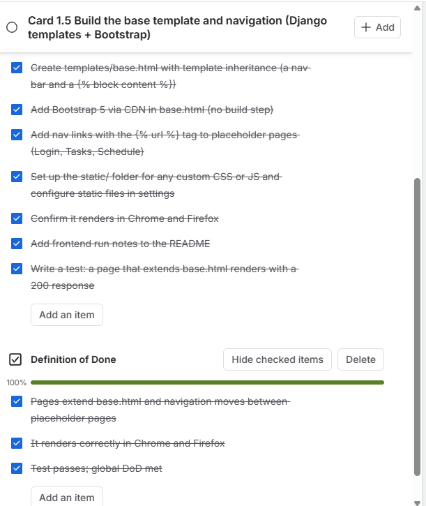
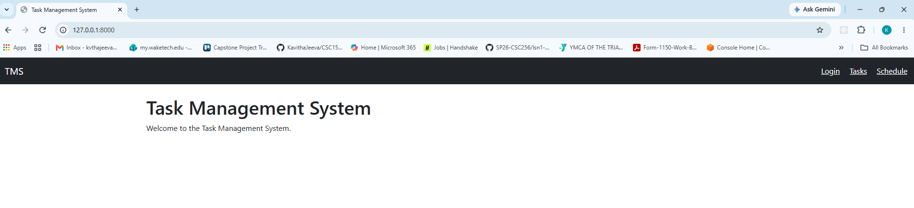
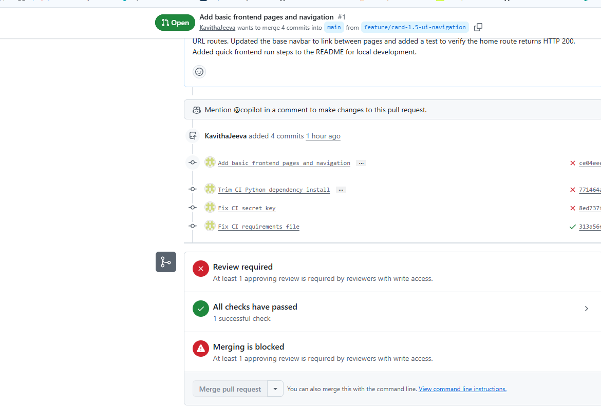

# Sprint #1 Review

## Group

Group 2

## Project Manager

Bethany Arielle Hill

## My Contribution

During the Sprint #1 Review, I demonstrated my completed work for **Card 1.5  Build Base UI Shell and Navigation Layout**. I demonstrated the base Django UI, Bootstrap navigation bar, and navigation links for Login, Tasks, and Schedule. I also showed that the application was tested successfully and that the CI checks passed.

## Evidence

