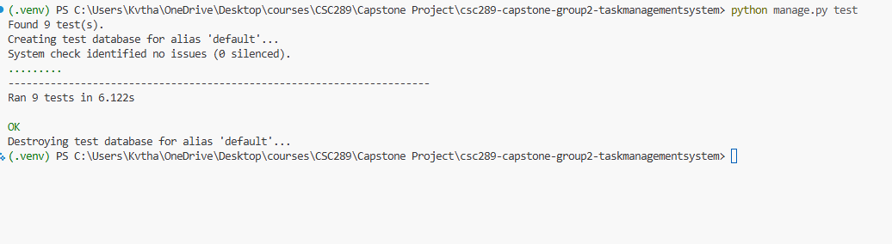

# CSC289 Programming Capstone

## Sprint #2 Backlog

**Project Name:** Task Management System

**Team Number:** Group 2

**Team Lead/Scrum Master:** Bethany Arielle Hill

## During Sprint #2

I worked on **Card 2.3 – Login Screen and Company-Email Login Flow (UX1)** and **Card 2.6 – Data Access** for the Task Management System.

For Card 2.3, I created and styled the login screen with email and password fields, added validation and error handling, and wrote tests for the login page and form submission.

For Card 2.6, I added login protection to the Tasks and Schedule pages, restricted task and schedule data to the logged-in user, protected individual records from unauthorized direct URL access, and added tests for user-data access control. All 9 tests passed successfully.

## Evidence

## Evidence

### Card 2.3 – Trello

### Card 2.3 – Code

### Card 2.3 – Tests

### Card 2.3 – CI

### Card 2.6 – Trello

### Card 2.6 – Task Data Access Code

### Card 2.6 – Schedule Data Access Code

### Card 2.6 – Tests

### Card 2.6 – CI

