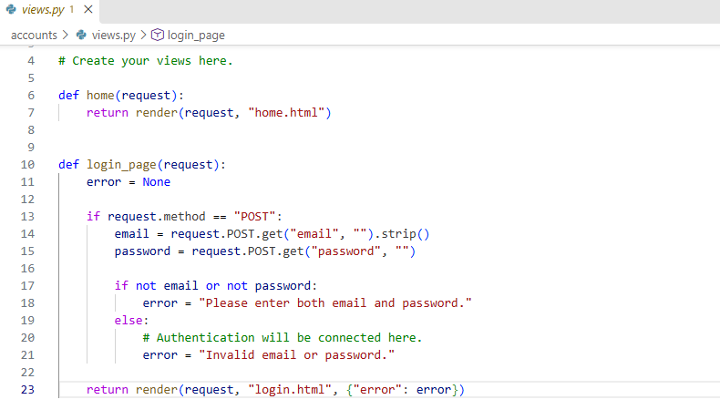
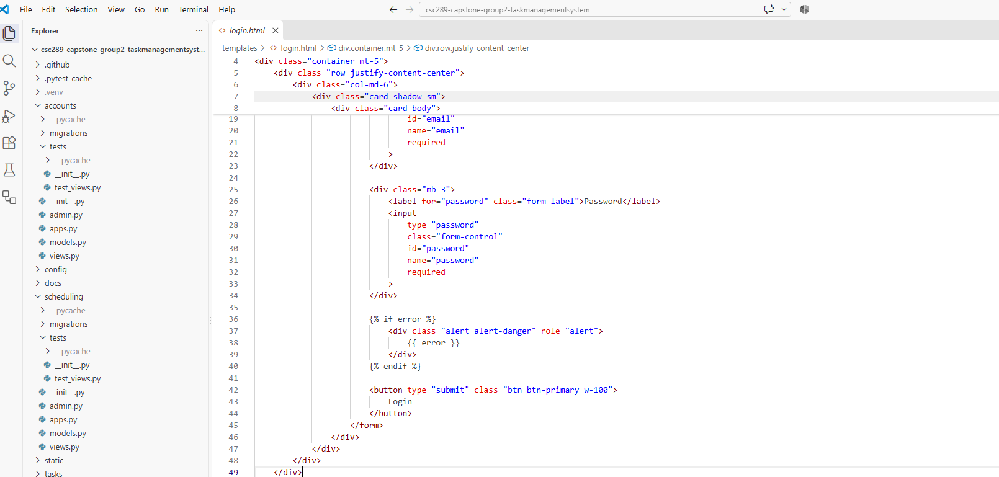
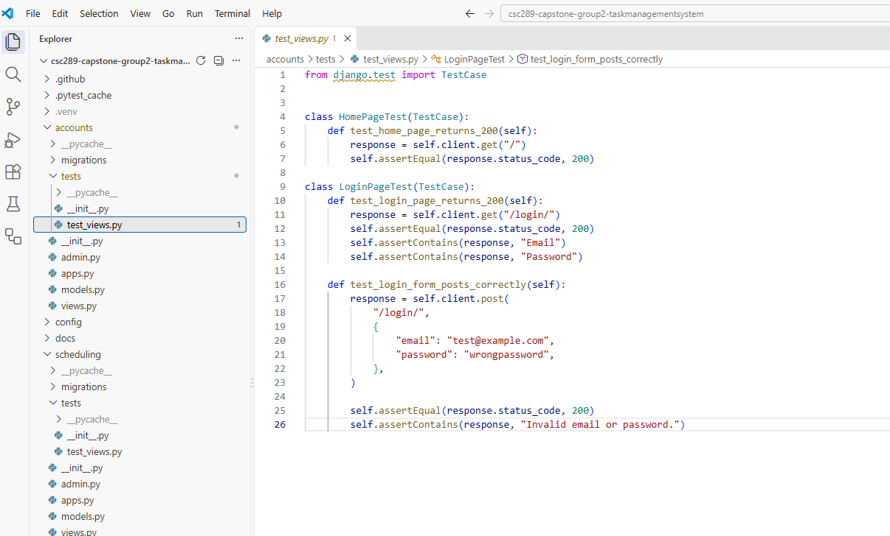
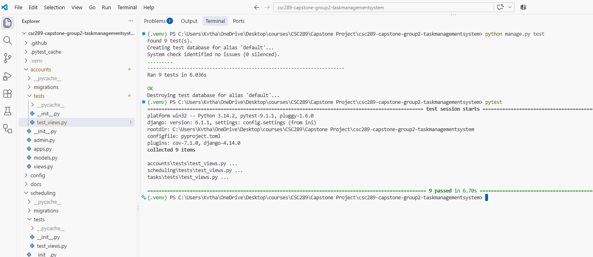
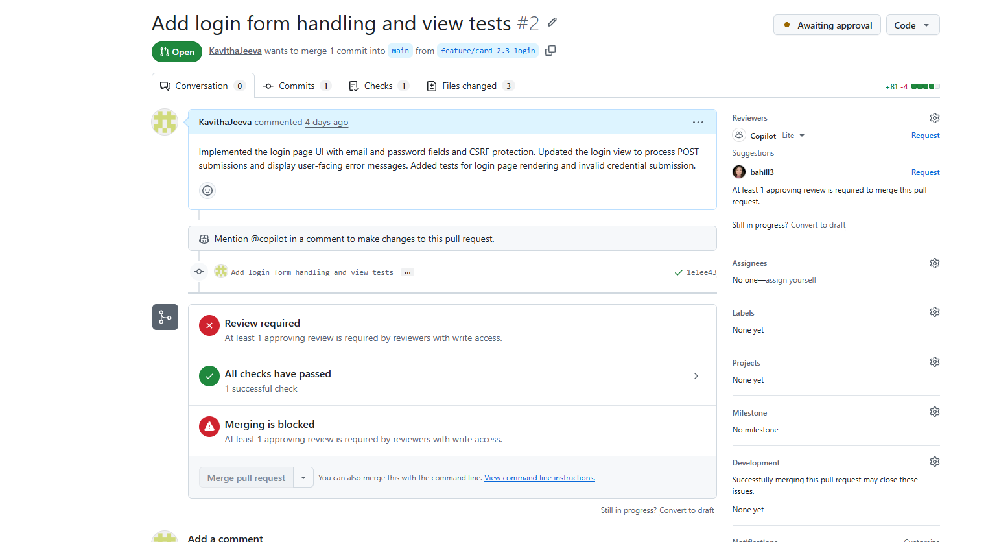

# CSC289 Programming Capstone

## Sprint #2 Status Update 1 – Week 1

**Project Name:** Task Management System

**Team Number:** Group 2

**Team Lead/Scrum Master:** Bethany Arielle Hill

### Tasks Scheduled for this week

1. Complete Card 2.3 – Login Screen and Company-Email Login Flow.
2. Add and run tests for the login feature.
3. Verify that the changes pass CI.

### Tasks Completed this week [Kavitha Jeeva]

1. Completed **Card 2.3 – Login Screen and Company-Email Login Flow (UX1)** by creating the login form with email and password fields.
2. Styled the login page to match the base UI and added validation and error messages.
3. Added tests for the login page and form submission.
4. Ran the tests successfully and verified that the CI check passed.

### Problems/Challenges/Roadblocks

I had some issues with the project setup and testing during development, but I was able to fix them and complete the login feature. **Status: Resolved**

### Evidence

### Card 2.3 – Code

### Card 2.3 – Tests Passed

### Card 2.3 – Login Page

### Card 2.3 – CI Passed

