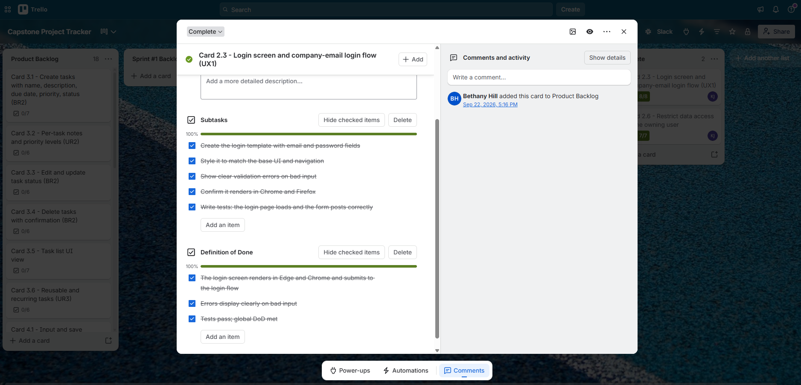
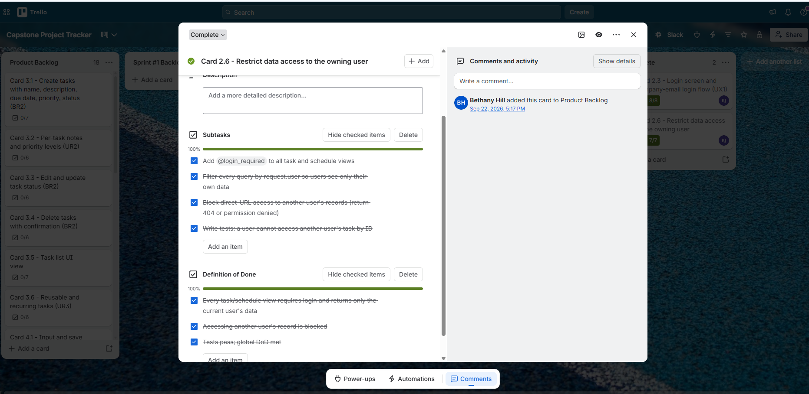

# CSC289 Programming Capstone

## Sprint #2 Status Update 1

**Project Name:** Task Management System

**Team Number:** Group 2

**Team Lead/Scrum Master:** Bethany Arielle Hill

### Tasks Scheduled for this week

1. Complete Card 2.3 – Login Screen and Company-Email Login Flow.
2. Complete Card 2.6 – Data Access.
3. Add and run tests for the completed features.
4. Verify that the changes pass CI.

### Tasks Completed this week [Kavitha Jeeva]

1. Completed **Card 2.3 – Login Screen and Company-Email Login Flow (UX1)** by creating the login form, styling it to match the base UI, adding validation errors, and adding tests for page rendering and form submission.
2. Completed **Card 2.6 – Data Access** by requiring authentication for Tasks and Schedule pages, filtering data by the logged-in user, protecting individual records from unauthorized access, and adding security tests.
3. Ran the project test suite successfully. All **9 tests passed**.
4. Verified that the CI check passed successfully.

### Problems/Challenges/Roadblocks

1. I initially had some issues with assignment submission requirements and file organization. **Status: Resolved**
2. During development, I corrected a missing test import and trailing whitespace issues. **Status: Resolved**

### Evidence

### Card 2.3 – Login

### Card 2.6 – Data Access

